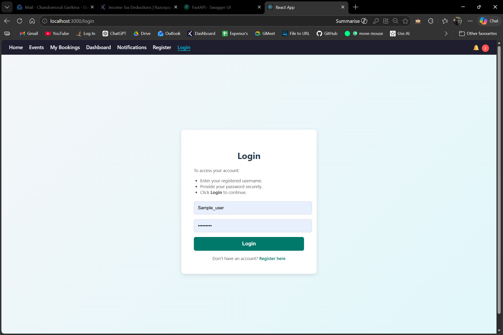
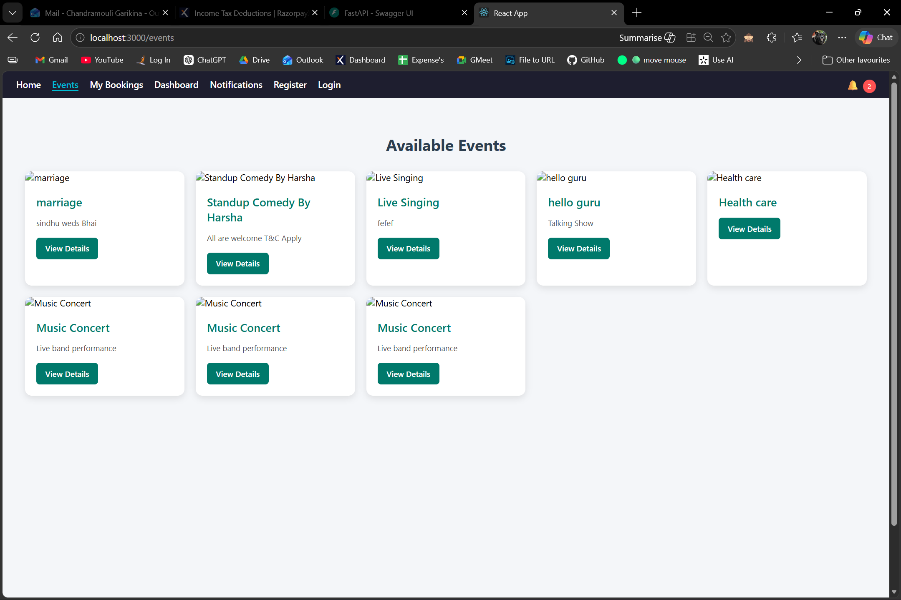
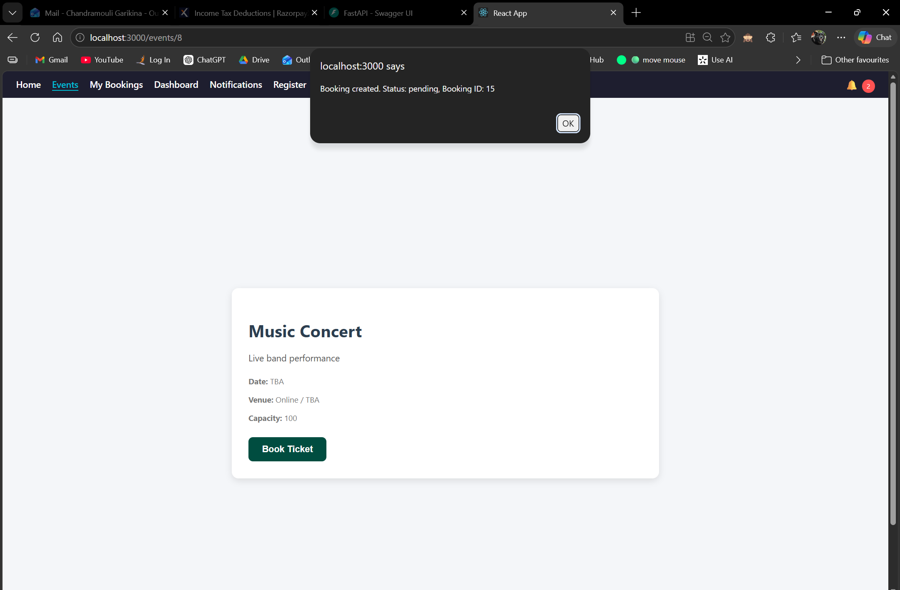
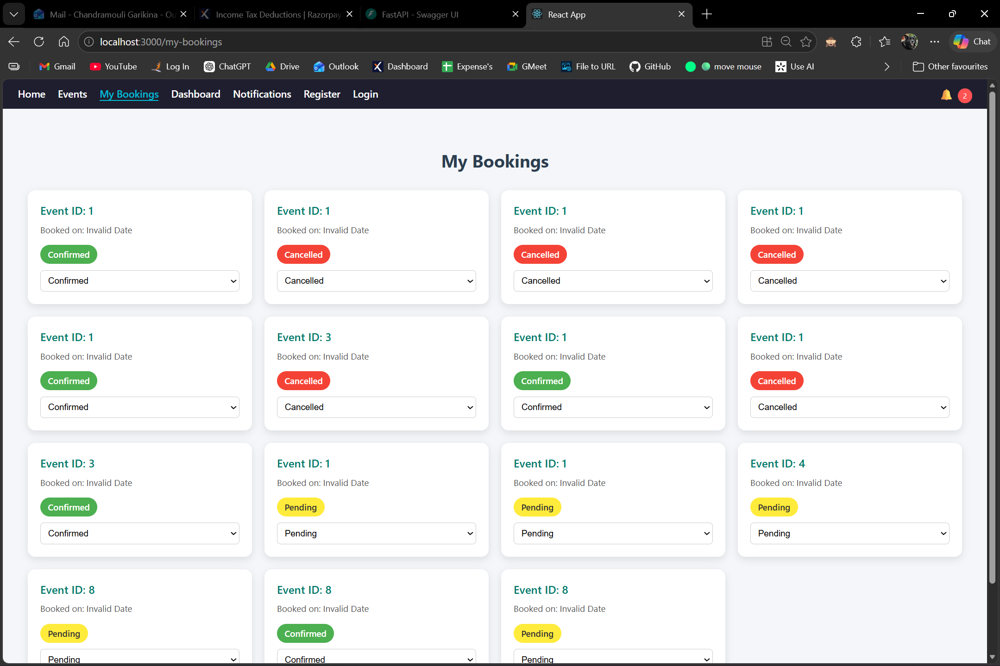
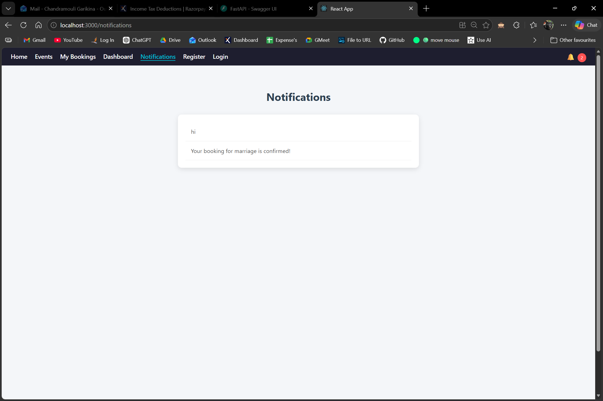
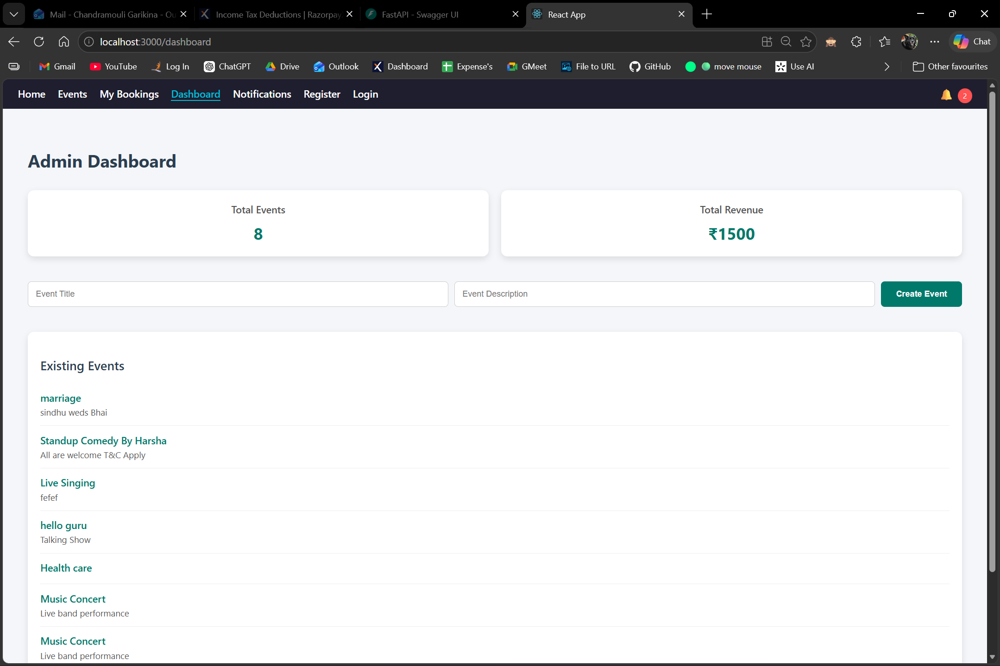

---
# 🎟️ Event Booking Platform

A full-stack application built with **FastAPI (backend)** and **React.js (frontend)** for managing events, bookings, notifications, payments, and admin analytics.

---

## 🚀 Features
- User authentication (Register/Login with JWT)
- Event creation, listing, and details
- Ticket booking and booking management
- Notifications system
- Payments integration (mock)
- Admin analytics (events & revenue)

---

## ⚙️ Setup Instructions

### Backend (FastAPI)
1. Clone the repository:
   ```bash
   git clone https://github.com/yourusername/event-booking-platform.git
   cd event-booking-platform/backend
   ```

2. Create and activate a virtual environment:
   ```bash
   python -m venv venv
   source venv/bin/activate   # Linux/Mac
   venv\Scripts\activate      # Windows
   ```

3. Install dependencies:
   ```bash
   pip install -r requirements.txt
   ```

4. Run the server:
   ```bash
   uvicorn app.main:app --reload
   ```
   Backend will be available at: `http://127.0.0.1:8000`

5. Swagger UI docs:  
   Visit `http://127.0.0.1:8000/docs`

---

### Frontend (React.js)
1. Navigate to frontend folder:
   ```bash
   cd ../frontend
   ```

2. Install dependencies:
   ```bash
   npm install
   ```

3. Start the development server:
   ```bash
   npm start
   ```
   Frontend will be available at: `http://localhost:3000`

---

## 📡 Example API Calls

### Auth
- **Register**
  ```http
  POST /auth/register
  {
    "username": "testuser",
    "password": "mypassword",
    "role": "user"
  }
  ```

- **Login**
  ```http
  POST /auth/login
  {
    "username": "testuser",
    "password": "mypassword"
  }
  ```

### Events
- **List Events**
  ```http
  GET /events/
  ```

- **Create Event**
  ```http
  POST /events/
  {
    "title": "Music Concert",
    "description": "Live band performance",
    "capacity": 100,
    "image": "/static/images/concert.jpg"
  }
  ```

### Bookings
- **Create Booking**
  ```http
  POST /bookings/
  {
    "event_id": 1,
    "user_id": 1
  }
  ```

- **My Bookings**
  ```http
  GET /bookings/my-bookings?user_id=1
  ```

- **Update Booking Status**
  ```http
  PUT /bookings/{booking_id}/status
  {
    "status": "confirmed"
  }
  ```

### Notifications
- **Create Notification**
  ```http
  POST /notifications/
  {
    "user_id": 1,
    "message": "Your booking is confirmed!"
  }
  ```

- **Get Notifications**
  ```http
  GET /notifications?user_id=1
  ```

### Payments
- **Make Payment**
  ```http
  POST /payments/
  {
    "booking_id": 1,
    "amount": 500
  }
  ```

---

## 🖼️ Screenshots

Add your screenshots here:

- Login Page  


- Events Listing  


- Event Details & Booking  


- My Bookings 


- Notifications  


- Admin Analytics  

---

## 📦 Deployment Notes
- Replace SQLite with PostgreSQL for production.
- Configure environment variables for DB connection and JWT secret.
- Serve static images via FastAPI or a CDN.
- Deploy backend (FastAPI) to **Render/Railway/Azure App Service**.
- Deploy frontend (React) to **Vercel/Netlify**.

---

## 👨‍💻 Author
Built by **Chandramouli Garikina**
```
